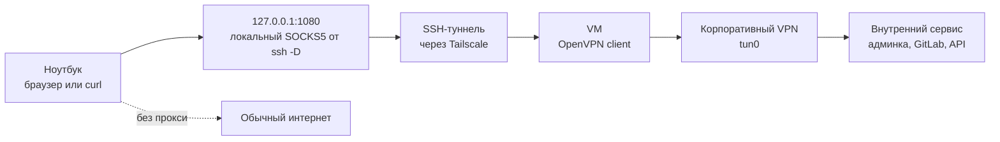

Иногда рабочий VPN нужен не для всего трафика, а только для нескольких внутренних сервисов: админок, дашбордов, GitLab, баз знаний или API, доступных только из корпоративной сети. В некоторых сетях OpenVPN напрямую может не работать, но без него часть рабочих сервисов недоступна.

Решение: поднять OpenVPN не на рабочем ноутбуке, а на отдельной виртуалке, доступной через Tailscale. Tailscale здесь нужен не только для удобного адреса, но и для того, чтобы закрыть доступ к виртуалке из внешнего интернета: SSH можно оставить доступным только внутри tailnet. Виртуалка подключается к корпоративному VPN и видит внутренний контур, а с ноутбука до неё прокидывается SSH SOCKS5-прокси. В итоге браузер или `curl` ходят во внутренние сервисы через цепочку `ноутбук -> Tailscale -> VM -> OpenVPN`, при этом основной интернет на ноутбуке остаётся как был.

Такой вариант удобен, когда не хочется ломать локальные маршруты, DNS и default route на основной машине. VPN живёт изолированно на VM, а на ноутбуке достаточно включать SOCKS5 только для запросов, которым нужен доступ во внутреннюю сеть.

Когда всё уже настроено, на виртуалке достаточно сделать так:

```shell
# 1. Подключиться к VM через Tailscale
$ ssh user@<tailscale-ip-vm>

# На VM:
$ sudo openvpn --config /etc/openvpn/client/corporate-vpn.conf

# В другой терминальной сессии:
$ ssh -D 1080 user@<tailscale-ip-vm>
```

В браузере нужно включить маршрутизацию через SOCKS5-прокси.

# 0. Что получится

- VM подключена к tailnet
- OpenVPN даёт доступ к внутренним сетям компании
- default route не ломается
- с ноутбука есть доступ к внутренним сервисам через Tailscale → SSH → SOCKS5

------

# 1. Установка

```
sudo apt update
curl -fsSL https://tailscale.com/install.sh | sh
sudo tailscale up
sudo apt install -y openvpn resolvconf
```

Проверка Tailscale:

```
tailscale status
```

------

# 2. Подготовка файлов

## 2.1 Конфиг OpenVPN

```
sudo mkdir -p /etc/openvpn/client
sudo nano /etc/openvpn/client/corporate-vpn.conf
```

Вставь:

```
remote vpn1.example.com 1194 udp
remote vpn2.example.com 1194 udp
remote vpn3.example.com 1194 udp
remote-random

dev tun
nobind
tls-client
persist-key
persist-tun

auth-user-pass /etc/openvpn/client/creds.txt
auth-nocache

reneg-sec 0
setenv CLIENT_CERT 0

pull
pull-filter ignore redirect-gateway
route-nopull

# --- КРИТИЧНО ---
# исключаем VPN-серверы, иначе получится recursive routing
# Может потребоваться добавить конкретные IP VPN-серверов.
# Смотри логи VPN:
# Peer Connection Initiated with [AF_INET]203.0.113.10:1194
route 203.0.113.10 255.255.255.255 net_gateway

# --- маршруты в корпоративную сеть ---
route 10.20.0.0 255.255.0.0

# (опционально точечные сети)
route 10.20.3.0 255.255.255.0
route 10.20.23.0 255.255.255.0
route 10.20.32.0 255.255.255.0
route 10.20.48.0 255.255.255.0
```

### Как узнать эти IP-адреса и маршруты

В примере выше есть два разных типа маршрутов:

- `route 203.0.113.10 255.255.255.255 net_gateway` — IP самого VPN-сервера, до которого нужно ходить через обычный интернет, а не через VPN-туннель
- `route 10.20.0.0 255.255.0.0` и точечные `route 10.20.x.0 255.255.255.0` — внутренние сети, которые должны идти через `tun0`

IP VPN-сервера можно взять из логов OpenVPN при ручном запуске:

```shell
sudo openvpn --config /etc/openvpn/client/corporate-vpn.conf
```

В выводе ищи строку вроде:

```text
Peer Connection Initiated with [AF_INET]203.0.113.10:1194
```

`203.0.113.10` — это адрес, который нужно исключить из VPN-маршрутизации:

```text
route 203.0.113.10 255.255.255.255 net_gateway
```

Если в конфиге несколько `remote`, проверь каждый hostname:

```shell
getent ahostsv4 vpn1.example.com
getent ahostsv4 vpn2.example.com
getent ahostsv4 vpn3.example.com
```

Для каждого реального IP VPN-сервера можно добавить отдельную строку:

```text
route 203.0.113.10 255.255.255.255 net_gateway
route 203.0.113.11 255.255.255.255 net_gateway
route 203.0.113.12 255.255.255.255 net_gateway
```

Внутренние сети проще всего определить от конкретных внутренних хостов, к которым нужен доступ. Сначала узнай IP внутреннего домена:

```shell
getent hosts internal.service.example.com
```

Если DNS для внутренних доменов работает только внутри VPN, сделай временную копию конфига, закомментируй в ней `route-nopull` и свои ручные `route ...`, затем запусти OpenVPN с этой копией:

```shell
sudo cp /etc/openvpn/client/corporate-vpn.conf /tmp/corporate-vpn-discovery.conf
sudo nano /tmp/corporate-vpn-discovery.conf
sudo openvpn --config /tmp/corporate-vpn-discovery.conf
```

Пока OpenVPN запущен, в другом терминале посмотри, какие маршруты появились на `tun0`:

```shell
ip route show dev tun0
```

Или посмотри в логах, какие маршруты OpenVPN получил от сервера и пытался добавить:

```shell
journalctl -u openvpn-client@corporate-vpn -b
```

После этого проверь конкретный внутренний IP:

```shell
ip route get 10.20.3.10
```

Если маршрут настроен правильно, в ответе будет `dev tun0`. Если трафик уходит через обычный интерфейс, добавь более подходящую сеть. Например, для `10.20.3.10` можно добавить точечную `/24`:

```text
route 10.20.3.0 255.255.255.0
```

А если много внутренних сервисов лежат в одном крупном диапазоне, можно добавить более общий маршрут:

```text
route 10.20.0.0 255.255.0.0
```

Не добавляй слишком широкий маршрут вроде `route 10.0.0.0 255.0.0.0`, если не уверен, что весь этот диапазон должен идти через VPN. Чем точнее маршруты, тем меньше шансов сломать доступ к другим сетям.

------

## 2.2 Логин/пароль

```
sudo vi /etc/openvpn/client/creds.txt
```

Содержимое:

```
USERNAME
PASSWORD
```

Права:

```
sudo chmod 600 /etc/openvpn/client/creds.txt
```

------

# 3. Запуск и проверка

## 3.1 Запуск

```
sudo openvpn --config /etc/openvpn/client/corporate-vpn.conf
```

------

## 3.2 Проверка маршрутов

```
ip route
```

Важно:

❌ НЕ должно быть:

```
default via ... dev tun0
```

✅ Должно быть:

```
10.x.x.x dev tun0
```

------

## 3.3 Проверка Tailscale

```
tailscale status
ping <tailscale-ip>
```

Если SSH или пинг умерли, значит VPN сломал маршруты. Проверь `redirect-gateway`.

------

## 3.4 Проверка доступа к внутренней сети

```
ip route get 10.20.3.10
```

Ожидаемый результат:

```
dev tun0
```

------

# 4. Автозапуск через systemd

```
sudo systemctl enable openvpn-client@corporate-vpn
sudo systemctl start openvpn-client@corporate-vpn
```

Проверка:

```
sudo systemctl status openvpn-client@corporate-vpn
```

Логи:

```
journalctl -u openvpn-client@corporate-vpn -b
```

------

# 5. SOCKS5 через SSH

На ноутбуке внутри tailnet:

```
ssh -D 1080 user@<tailscale-ip-vm>
```

Это создаёт:

```
SOCKS5 → 127.0.0.1:1080
```

------

# 6. Использование

## 6.1 curl

```
curl --socks5-hostname 127.0.0.1:1080 https://internal.service
```

------

## 6.2 Браузер

Настрой SOCKS5-прокси в браузере, системных настройках или через расширение:


Критично:

- DNS тоже должен идти через прокси
- иначе внутренние домены не будут работать

------

# 7. Ограничение SSH только через Tailscale

Смысл Tailscale в этой схеме — держать VM закрытой от внешнего интернета. На публичном интерфейсе SSH лучше не оставлять, а доступ разрешить только из диапазона tailnet.

Если используешь firewalld:

```
sudo firewall-cmd --permanent --remove-service=ssh
sudo firewall-cmd --permanent --add-rich-rule='rule family="ipv4" source address="100.64.0.0/10" service name="ssh" accept'
sudo firewall-cmd --reload
```

# 8. Отладка

## Проверка маршрута

```
ip route get <internal-ip>
```

## Проверка через VM

```
curl -vk https://internal-host
```

## Проверка через SOCKS

```
curl --socks5-hostname 127.0.0.1:1080 https://internal-host
```

------

# 9. Типичные проблемы

### ❌ Нет доступа к внутренней сети

→ не добавлены `route`.

### ❌ Упал Tailscale

→ где-то появился `redirect-gateway`.

### ❌ DNS не работает

→ нужен `--socks5-hostname` или настройка DNS на VM.

### ❌ SSH доступен снаружи

→ не настроен firewall.

------

# Итог

Минимально нужное:

1. В конфиге:

   ```
   pull-filter ignore redirect-gateway
   route-nopull
   route ...
   ```

2. Поднять VPN на VM.

3. С ноутбука:

   ```
   ssh -D 1080 user@<tailscale-ip>
   ```

4. Направить браузер через SOCKS5.

------

# Заключение

В этой схеме виртуалка становится небольшим шлюзом во внутренний контур: она держит OpenVPN, а ноутбук использует её только как SOCKS5-прокси. За счёт этого корпоративные маршруты, DNS и особенности OpenVPN остаются на отдельной машине и не ломают повседневную сеть на ноутбуке.

Это не замена нормальному VPN-доступу и не универсальное решение для всего трафика. Но для сценария, где нужно иногда открыть внутренний сервис, сходить в админку или проверить API, такой вариант получается достаточно простым и предсказуемым: включил VPN на VM, поднял `ssh -D`, направил нужные запросы через SOCKS5.
