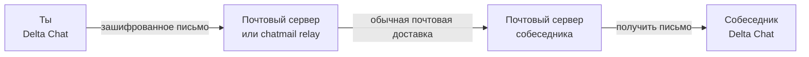
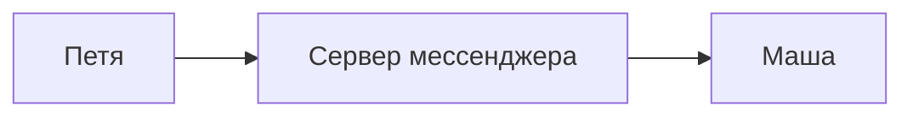
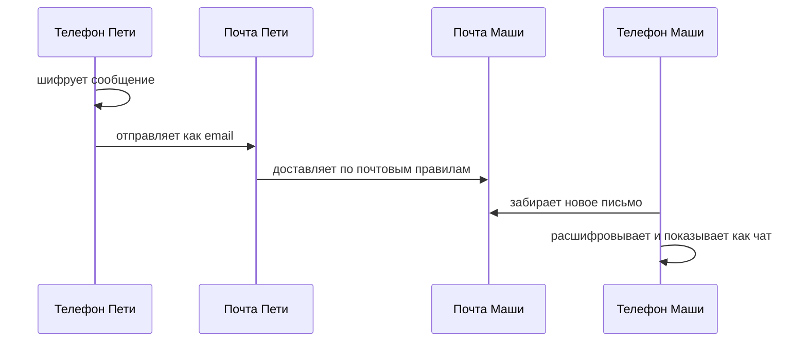
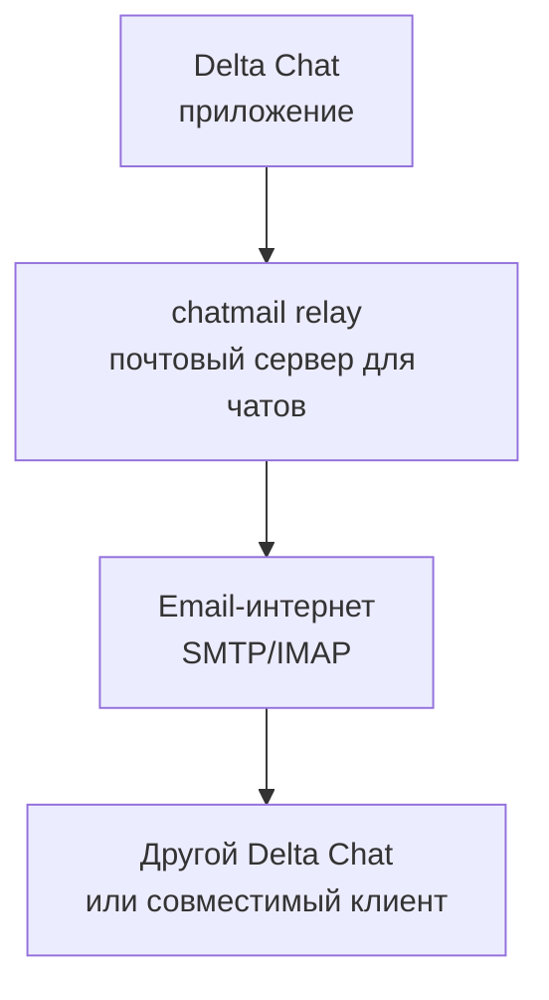

`
Со всеми блокировками, замедлениями, запретами и прочими радостями цифрового забора начинаешь задумываться о всё более странных методах сопротивления.

Сначала это выглядит как шутка:

> А что если чатиться письмами?

Не в смысле «дорогая редакция, здравствуйте», не в смысле длинных полотен на три экрана, а буквально как в мессенджере: короткие сообщения, группы, картинки, уведомления, вот это всё. Только под капотом не очередной централизованный сервис, который можно прихлопнуть одним красивым постановлением, а старая добрая электронная почта.
`
Оказалось, что такая штука уже есть. Называется [Delta Chat](https://delta.chat/).

<!--more-->

Идея настолько простая, что даже немного обидно: берём email, надеваем на него интерфейс мессенджера, добавляем нормальное шифрование, QR-коды для добавления контактов, пуши, группы, картинки, файлы и получаем чат, который едет по почтовым рельсам.

То есть внешне это выглядит как Telegram, Signal или WhatsApp:

- открыл приложение;
- выбрал контакт;
- написал «ну что там?»;
- получил ответ;
- отправил мем с котом.

А внутри это примерно так:

С точки зрения интернета это не обязательно выглядит как «опасный запрещённый мессенджер». Это может выглядеть как почта. Очень скучная, очень древняя, очень везде присутствующая почта.

## Как это работает

У обычного мессенджера обычно есть свой большой центральный дом:

Если этот дом заблокировать, сломать, купить, отжать, испортить или сделать вид, что его никогда не существовало, то всем жильцам становится грустно.

У Delta Chat логика другая. Он не изобретает отдельную вселенную для доставки сообщений. Он использует почтовую инфраструктуру: SMTP для отправки и IMAP для получения. Это те самые протоколы, благодаря которым обычные письма десятилетиями ползают между серверами, клиентами, доменами и странными корпоративными ящиками вида `info@spermank.ru`.

Delta Chat просто говорит:

> Окей, письмо. Но пусть оно будет коротким, быстрым, в виде чата и зашифрованным.

Примерно так:

Получается немного киберпанк наоборот. Не «мы построили новый сверхсовременный протокол будущего», а «мы взяли дедушкину почту, прикрутили к ней нормальный UX и заставили её притворяться мессенджером».

## А где безопасность?

Главный вопрос: если это email, значит ли это, что всё читают почтовые серверы?

В нормальном сценарии -- нет. Delta Chat использует сквозное шифрование. Сообщение шифруется на устройстве отправителя и расшифровывается на устройстве получателя. Серверы по дороге должны видеть только техническую шелуху: кому доставить, откуда пришло, куда положить. Сам текст сообщения для них должен быть нечитаемым.

Для обмена ключами используются QR-коды, invite links и Autocrypt. Если сказать человеческим языком: приложения договариваются между собой, как шифровать переписку, а человеку не нужно вручную возиться с ключами, файлами, отпечатками и прочими радостями из мира «я просто хотел написать маме».

Самый приятный пользовательский сценарий такой:

- установили Delta Chat;
- создали профиль;
- встретились глазами или в интернете;
- отсканировали QR-код или открыли invite link;
- начали писать.

Всё. Никакой магической церемонии с бубном и `gpg --armor`.

## Что такое chatmail

Раньше Delta Chat можно было воспринимать почти как «мессенджер поверх обычного почтового ящика». Берёшь свой email, подключаешь его к приложению, и оно начинает показывать письма как чаты.

Но у обычной почты есть проблема: она слишком обычная. Gmail, корпоративные сервера, старые ящики, веб-почта, странные настройки, лимиты, спам-фильтры, задержки, уведомления, политики безопасности -- всё это может вести себя непредсказуемо.

Поэтому появился chatmail. Это по сути почтовый сервер, но заточенный именно под чат:

- быстро доставлять сообщения;
- нормально работать с push-уведомлениями;
- по умолчанию требовать сквозное шифрование;
- не превращаться в вечный архив всей вашей жизни;
- не заставлять пользователя понимать, что такое IMAP и почему оно опять не логинится.

То есть chatmail -- это не новый закрытый супермессенджер. Это скорее почтовая станция, которая перестала делать вид, что на дворе 2004 год.

## Зачем это вообще нужно

Потому что почта -- это таракан цифрового мира.

Её много. Она везде. Она старая. Она некрасиво шевелится в углу, но переживает такие катастрофы, после которых модные платформы уже лежат лицом в продакшен.

Заблокировать один мессенджер сравнительно понятно: вот приложение, вот домены, вот IP, вот трафик. Да, всё равно сложно, но хотя бы понятно, куда бить.

С почтой хуже. Почта нужна банкам, магазинам, университетам, государственным сервисам, авиакомпаниям, хостингам, врачам, доставке пиццы и человеку, который в 2026 году всё ещё пересылает документы в `.doc`.

Если чат едет по почтовой инфраструктуре, его сложнее отделить от обычной жизни. Это не делает его неуязвимым. Сервер можно заблокировать. Домен можно заблокировать. Приложение можно удалить из стора. Интернет вообще можно выключить, если достаточно сильно захотеть прославиться в учебниках.

Но стоимость атаки становится другой. Вместо «выключили один большой рубильник» получается бесконечная игра в крота: один сервер закрыли, другой подняли, третий переехал, четвёртый вообще чей-то домашний. А почтовые протоколы всё ещё стоят в фундаменте интернета и делают вид, что ничего не происходит.

## Это замена Telegram?

Не совсем.

Delta Chat не пытается быть социальной сетью, медиа-платформой, каналом на миллион подписчиков и рынком крипто-стикеров одновременно. Это скорее личная переписка и небольшие группы. Ближе к Signal по духу, но с очень странным транспортом: не «наш сервер доставит всё», а «письмо пошло».

И в этом есть отдельная красота.

Мессенджеры последних лет часто выглядят как красивые аэропорты: стекло, металл, контроль, рамки, камеры, табло, всё блестит. Delta Chat больше похож на поезд, который ходит по старым рельсам. Может быть не так гламурно, зато рельсы уже проложены через полконтинента.

## Я поднял свой

В общем, мне стало любопытно, и я поднял свой Delta Chat / chatmail relay:

[chat.chur.ru](https://chat.chur.ru/)

Можно считать это маленькой почтовой голубятней. Только голуби зашифрованные, летают через SMTP и иногда присылают push-уведомления.

Официальные материалы, если хочется копнуть глубже:

- [Delta Chat FAQ](https://delta.chat/en/help)
- [Chatmail relay docs](https://chatmail.at/doc/relay/)
